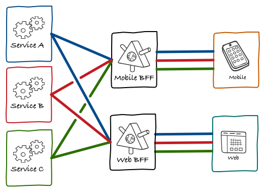

요즘 MSA(MicroService Architecture)를 많이 사용하게 되는데 다음과 같은 상황을 맞이 할 수 있다.
1. 여러 개의 service로 이루어져 있기 떄문에 entry point 하나로는 충분한 데이터를 불러오지 못하여 여러 entry point를 호출하여 데이터를 조합해야되는 상황

2. 여러 플랫폼(데스크톱, 모바일(AO, IOS))에 서비스를 지원하게 되면서 각각의 플렛폼에 맞는 데이터를 제공해 주기 위해 API를 복잡하게 구성 해야되는 상황

3. 이에 따라 client에서 UI를 구성하기 위해 여러가지 API를 호출하고, 데이터를 조합/가공하는 처리가 추가해야되는 상황

## BFF란?
Backend For Frontend의 약자로 Frontend를 위한 Backend server이다.  
여러 조건에 대한 처리는 서버에서 처리하고, BFF에서는 client에 필요한 데이터를 얻기 위해 API 호출 및 데이터 가공/조합을 담당한다.

BFF를 사용하는 경우 아래와 같은 이점을 얻을 수 있다.
1. Over Fetching이나 Under Fetching 문제를 해결할 수 있다.
2. BFF에서 화면에 필요한 데이터를 불러오고 처리하는 로직을 담당하게 된다.
3. 불 안정한 모바일 네트워크 환경보다 안정적인 환경에서 API를 호출하기 때문에 안정적으로 서비스를 제공할 수 있다.
4. BFF 이후에 API gateway가 추가된 구조에서 API 요청 시 gateway를 거치는 횟수가 줄어든다.

### Over Fetching과 Under Fetching
**Over Fetching**  
API 호출 시 실제로 필요한 데이터 이외의 불 필요한 데이터가 포함된 경우를 말하며 네트워크가 낭비가 일어났다고 할 수 있다.

**Under Fetching**  
하나의 API로 필요한 모든 데이터를 처리하지 못한다는 의미로, 여러 번의 API 호출이 필요하므로 요청 횟수가 증가한다는 문제가 있다.

### 데이터 처리 로직 분리에 대한 이점
프론트엔드에서 데이터를 가공하면, 사용자 모바일/데스크톱 컴퓨터 자원을 쓸 수 있다는 점은 좋지만 모바일의 경우 배터리 소모 문제를 고려해야 할 수도 있다.  
간단한 로직을 처리하여 많은 컴퓨터 자원을 사용하지 않더라도 복잡도 관점에서 보면 프론트엔드가 UI 로직에 집중할 수 있도록 하기 때문에 유지보수와 캡슐화 관점에서 이점이 있다고 할 수 있다.

### BFF 이후에 API gateway가 추가된 구조
프로트엔드에 관한 처리 만을 위한 BFF를 두고 이후에 통합적인 API Gateway를 둠으로써 공통적인 인증/인가,로깅 등의 처리를 통제하는 구조로 구성한 경우

## BFF with GraphQL
client에서 mobile과 PC를 같이 지원하는 경우 BFF + graphQL로 구성하는 것이 장점이 될 수 있다.  
모바일과 데스크톱의 경우 UI 구성이 다르기 때문에 GraphQL을 제공한다면 서버에서는 API를 사용자 환경별로 즉, 모바일과 데스크톱에 따라 다르게 제공하지 않아도 되고, 유지보수성 역시 좋아진다.

> 참고  
> [WebFlux와 코루틴으로 BFF(Backend For Frontend) 구현하기](https://tech.kakaopay.com/post/bff_webflux_coroutine)  
> [BFF가 뭘까?](https://seungdols.tistory.com/865)